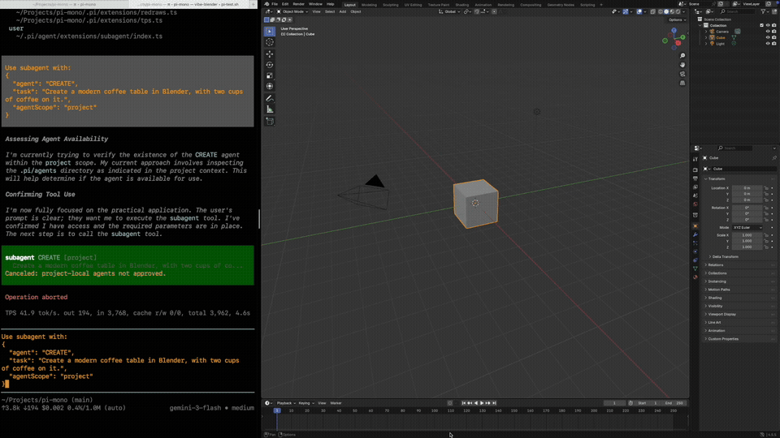

# vibe-blender

[](assets/BlenderAgent_0226_3.mp4)

`vibe-blender` is a Blender-native agent workflow built on the pi coding-agent runtime.

The model works through Blender-specific tools instead of subagents. It can initialize a managed workspace, execute Blender Python, inspect scene state, save named views, and render images while keeping a persistent `model.blend` in one workspace.

## Current direction

The repo is moving toward one primary workflow:

- one `vibe-blender` runtime
- Blender tools active by default
- reusable Blender skills for `create`, `edit`, `analyze`, and reference-guided work
- one explicit workspace per task

## Built-in Blender tools

When you start `vibe-blender`, these Blender tools are loaded automatically:

- `blender_workspace_init`
- `blender_execute_python`
- `blender_scene_info`
- `blender_save_view`
- `blender_render`
- `blender_log_critique`

Generic coding tools such as `read`, `edit`, `write`, `grep`, `find`, `ls`, and `bash` remain available for logs, manifests, and generated scripts.

## Built-in Blender skills

The bundled Blender extension also provides these skills:

- `/skill:blender-create`
- `/skill:blender-edit`
- `/skill:blender-analyze`
- `/skill:blender-with-reference`

These skills add workflow guidance. The actual scene work still happens through Blender tools.

## Requirements

- Blender installed locally
- this repo checked out locally
- dependencies installed

Recommended Blender binary on macOS:

```bash
export BLENDER_PATH="/Applications/Blender.app/Contents/MacOS/Blender"
```

## Setup

From the repo root:

```bash
npm install
```

## Usage

Start the CLI:

```bash
./pi-test.sh
```

Or run the built CLI directly:

```bash
vibe-blender
```

Example prompts:

```text
Use /skill:blender-create and build a modern coffee table in Blender.
```

```text
Initialize a workspace and create a stylized desk lamp in Blender.
```

```text
Use /skill:blender-edit with workspace=outputs/20260306_120000 and make the lamp shade wider.
```

```text
Use /skill:blender-analyze with workspace=outputs/20260306_120000 and tell me which objects and materials are present.
```

## Workspace model

Every Blender task should use an explicit `workspace` path. The tools return the workspace path so follow-up turns can continue the same task without guessing.

Typical structure:

```text
outputs/TIMESTAMP/
├── blender-workspace.json
├── critique.log
├── model.blend
├── script.py
└── iteration_01/
    ├── scene-info.json
    ├── script.py
    ├── blender.log
    └── renders/
        └── render.png
```

The workspace root `script.py` is the canonical current Blender script. Each execution snapshots that file into the current `iteration_XX/` folder before running.
The workspace root `critique.log` stores the render critique for each create/edit iteration.
`blender_scene_info` writes `scene-info.json` into the current iteration folder.
`blender_scene_info` can inspect all scene categories by default, or only a subset via `categories` such as `["objects"]`, `["cameras", "cameraSettings"]`, `["cameras", "lights"]`, `["views"]`, or the full set.
`cameras` reports camera scene objects with transform data and their linked camera settings names.
`cameraSettings` reports the camera data blocks with lens, clip, sensor, and ortho settings.
`views` reports saved workspace views from the manifest.
`blender_save_view` with `source="active-camera"` captures the current live Blender UI viewport into a dedicated camera object, sets it as `scene.camera`, saves the `.blend`, and stores the view name -> camera object mapping in the workspace manifest. This requires the Blender UI process launched by `vibe-blender` or another Blender session started with the bundled live bridge script.
For create/edit work, the model should use the normal `write` and `edit` tools on `$workspace/script.py`, then call `blender_execute_python` with `script_path` pointing to that file.

## Save Current View

To save the current Blender viewport as a reusable render view:

1. Start `vibe-blender` so Blender launches with the live bridge script loaded.
2. Open the workspace `model.blend` in that bridge-enabled Blender session.
3. Move a `3D Viewport` (`VIEW_3D`) to the exact view you want to save.
4. Call `blender_save_view` with `source="active-camera"` and a saved view name.

Example:

```json
{
  "workspace": "outputs/modern_timber_house",
  "name": "hero-front",
  "source": "active-camera"
}
```

Optional dedicated camera name:

```json
{
  "workspace": "outputs/modern_timber_house",
  "name": "hero-front",
  "source": "active-camera",
  "camera_name": "hero-front-cam"
}
```

Later, render from that saved view:

```json
{
  "workspace": "outputs/modern_timber_house",
  "view": "hero-front"
}
```

Notes:

- The user does not need to manually save after adjusting the viewport; `blender_save_view` saves the `.blend` after capturing the view.
- The open file must already be the workspace `model.blend`, not an unsaved new Blender scene.
- If multiple `VIEW_3D` areas are open, vibe-blender captures the largest one.

## Design principles

- use Blender tools directly instead of subagents
- keep `workspace` explicit in Blender tool calls
- inspect before mutating when editing existing scenes
- render after meaningful scene changes
- keep one persistent `.blend` per workspace

## Legacy note

Older subagent-oriented CREATE workflow material remains in `.pi/agents/` as legacy reference only. It is no longer the primary architecture described by this repo.

## License

MIT
